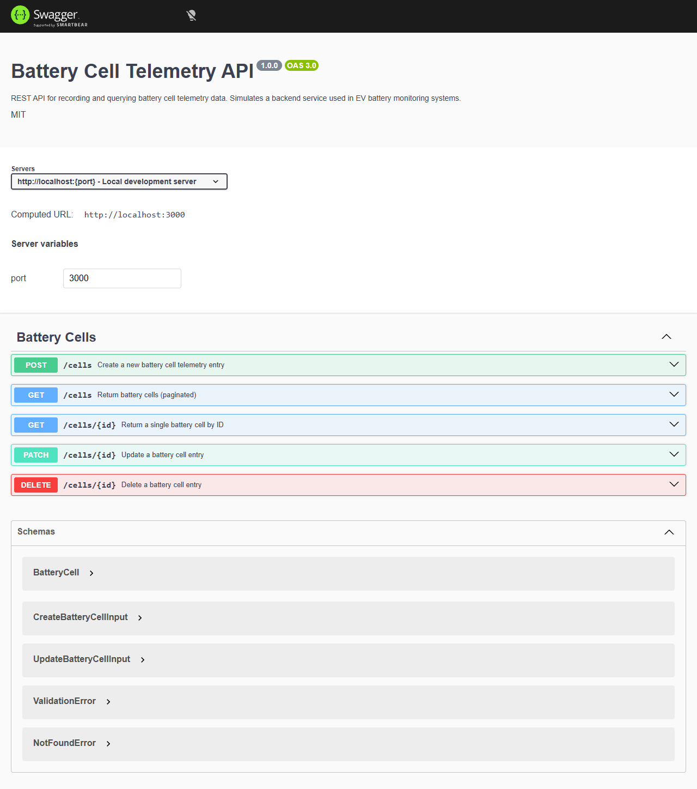

# Battery Cell Telemetry API

A RESTful API for recording and querying battery cell telemetry data, simulating a backend service used in **electric vehicle (EV) battery monitoring systems**.

Built as a demonstration of full-stack backend engineering competence with modern tooling and clean architecture.

---

## Tech Stack

| Layer | Technology |
| -------------- | -------------------------------- |
| Runtime | Node.js |
| Language | TypeScript |
| Framework | Express |
| Database | PostgreSQL |
| ORM | TypeORM |
| API Docs | Swagger / OpenAPI 3 (swagger-ui) |
| Validation | express-validator |
| Dev Server | ts-node-dev |
| API Testing | Postman |

---

## Project Structure

```
src/
├── config/
│   ├── env.ts            # Environment variable loader
│   └── swagger.ts        # OpenAPI / Swagger configuration
├── controllers/
│   └── cell.controller.ts
├── database/
│   └── data-source.ts    # TypeORM DataSource
├── entities/
│   └── BatteryCell.ts    # TypeORM entity
├── middleware/
│   └── error-handler.ts  # Global error handler
├── routes/
│   ├── cell.routes.ts    # Express router + Swagger JSDoc
│   └── cell.validators.ts
└── server.ts             # Application entry point
postman/
└── battery-cell-api.postman_collection.json
```

---

## Prerequisites

- **Node.js** ≥ 18
- **PostgreSQL** ≥ 14

---

## Getting Started

### 1. Clone the repository

```bash
git clone https://github.com/<your-username>/battery-cell-api-demo.git
cd battery-cell-api-demo
```

### 2. Install dependencies

```bash
npm install
```

### 3. Create the PostgreSQL database

```sql
CREATE DATABASE battery_cell_db;
```

### 4. Configure environment variables

```bash
cp .env.example .env
```

Edit `.env` with your PostgreSQL credentials:

```
PORT=3000
DB_HOST=localhost
DB_PORT=5432
DB_USERNAME=postgres
DB_PASSWORD=postgres
DB_NAME=battery_cell_db
DB_SYNCHRONIZE=true
DB_LOGGING=false
```

> **Note:** `DB_SYNCHRONIZE=true` enables automatic schema synchronisation during development. Disable it in production and use migrations instead.

### 5. Start the development server

```bash
npm run dev
```

The server starts at `http://localhost:3000`.

---

## API Endpoints

| Method | Path | Description |
| -------- | ------------ | ---------------------------------------- |
| `POST` | `/cells` | Create a new battery cell telemetry entry |
| `GET` | `/cells` | Retrieve all battery cells |
| `GET` | `/cells/:id` | Retrieve a single cell by UUID |
| `DELETE` | `/cells/:id` | Delete a cell by UUID |
| `GET` | `/health` | Health check |

---

## Example Requests

### Create a battery cell

```bash
curl -X POST http://localhost:3000/cells \
  -H "Content-Type: application/json" \
  -d '{
    "serialNumber": "CELL-2024-00042",
    "voltage": 3.72,
    "temperature": 28.5,
    "stateOfCharge": 87.3,
    "stateOfHealth": 99.1
  }'
```

**Response** `201 Created`

```json
{
  "id": "a1b2c3d4-e5f6-7890-abcd-ef1234567890",
  "serialNumber": "CELL-2024-00042",
  "voltage": 3.72,
  "temperature": 28.5,
  "stateOfCharge": 87.3,
  "stateOfHealth": 99.1,
  "createdAt": "2024-12-01T14:30:00.000Z"
}
```

### Get all cells

```bash
curl http://localhost:3000/cells
```

### Get cell by ID

```bash
curl http://localhost:3000/cells/a1b2c3d4-e5f6-7890-abcd-ef1234567890
```

### Delete a cell

```bash
curl -X DELETE http://localhost:3000/cells/a1b2c3d4-e5f6-7890-abcd-ef1234567890
```

---

## Swagger Documentation

Interactive API docs are available at:

```
http://localhost:3000/docs
```



*Screenshot placeholder — replace with an actual capture after running the server.*

---

## Postman Collection

A ready-to-import Postman collection is included at:

```
postman/battery-cell-api.postman_collection.json
```

Import it into Postman to test every endpoint. The collection uses a `baseUrl` variable (`http://localhost:3000`) and automatically captures the created cell's ID for subsequent requests.

---

## Scripts

| Script | Description |
| -------------- | ------------------------------------------- |
| `npm run dev` | Start dev server with hot reload |
| `npm run build`| Compile TypeScript to JavaScript |
| `npm start` | Run the compiled production build |

---

## About This Project

This project simulates a **battery cell telemetry backend** — the kind of service that sits behind a battery management system (BMS) in electric vehicles or energy storage platforms. In a production environment, telemetry data such as voltage, temperature, state of charge (SoC), and state of health (SoH) is continuously collected from individual cells and aggregated for monitoring, diagnostics, and predictive maintenance.

The API demonstrates:

- Clean REST API design with proper HTTP semantics
- Strong TypeScript typing throughout the stack
- TypeORM entity modelling and PostgreSQL integration
- Input validation and structured error responses
- Auto-generated OpenAPI documentation
- Professional project structure suitable for team collaboration

---

## License

MIT
